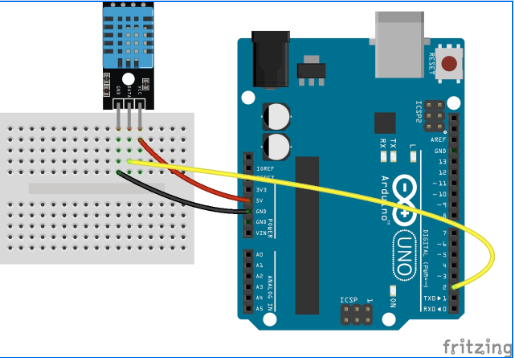

## Install Java for ARM64 & Do serial communication settings
```bash
chat@chat-desktop:~$sudo apt update
chat@chat-desktop:~$sudo apt install openjdk-8-jdk
chat@chat-desktop:~$ wget https://downloads.arduino.cc/arduino-1.8.19-linuxaarch64.tar.xz
chat@chat-desktop:~$ tar -xf arduino-1.8.19-linuxaarch64.tar.xz
chat@chat-desktop:~$ cd arduino-1.8.19
chat@chat-desktop:~/arduino-1.8.19$ sudo ./install.sh
chat@chat-desktop:~/arduino-1.8.19$ sudo usermod -a -G dialout chat
chat@chat-desktop:~/arduino-1.8.19$ ls /dev/tty*
chat@chat-desktop:~/arduino-1.8.19$ sudo chmod a+rw /dev/ttyACM0  
chat@chat-desktop:~/arduino-1.8.19$ cd 
chat@chat-desktop:~$ arduino
```

## Install SimpleDHT11 library 

## Sample code 
```c
#include <SimpleDHT.h>
int pinDHT11 = 2;
SimpleDHT11 dht11(pinDHT11);

void setup() {
  Serial.begin(9600);
}

void loop() {
  byte temperature = 0;
  byte humidity = 0;
  
  if (dht11.read(&temperature, &humidity, NULL) == SimpleDHTErrSuccess) {
    int temp = (int)temperature;
    int humid = (int)humidity;
    
    // 유효한 범위인지 확인
    if (temp >= 0 && temp <= 50 && humid >= 0 && humid <= 100) {
      Serial.print(temp);
      Serial.print(",");
      Serial.println(humid);
    }
  }
  
  delay(2000);  // 2초 대기
}

```
## Wiring



## Install Python 3.8 on Jetson Nano
```bash
1.update & upgrade
sudo apt update-> 건너띈다.
sudo apt upgrade

2. 필요한 패키지 설치
Y


3. python3.8 소스코드 받기
cd /
sudo wget https://www.python.org/ftp/python/3.8.12/Python-3.8.12.tar.xz

4. 압축 풀기
sudo tar -xf Python-3.8.12.tar.xz
cd Python-3.8.12

5. Build
#./configure --enable-optimizations
./configure --enable-loadable-sqlite-extensions --with-bz2
make -j4
6. 마무리
sudo make altinstall
python3.8 --version

7. 가상환경 (중요!!)
python3.8 -m venv myenv                                     
source myenv/bin/activate
```

## Jetson nano에 jupyter notebook 설치하기

### Install Jupyter Notebook 
```bash
pip install jupyter—>  error ->sudo apt-get update
sudo apt-get install python3-dev libssl-dev libffi-dev
sudo apt-get install python3 python3-pip
pip install openai
pip install gradio

```

